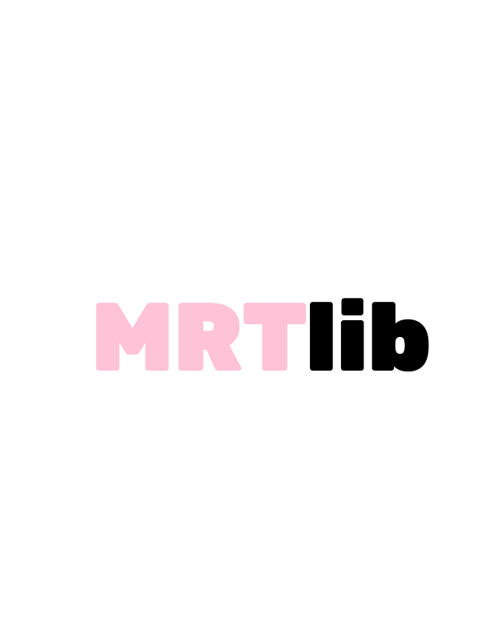

Chrome browser extension for the McGill Rocket Team's SMD components library. 

**Note:** This is a mirrored repository, all further development will continue from this repository. The original repository can be  found at the link [here](https://github.com/lucagdangelo/MRTlib).

## Brief User Guide
* Access is restricted to users who hold a valid student McGill email address (i.e. *@mail.mcgill.ca)
* You will have to login each time you want to add a component to the database or if you exit the extension. I haven't figured out a way to fix this yet :/

## Installation
* Installation from the Chrome Web Store
    1. Go to the Chrome Web Store at the following link: `https://chrome.google.com/webstore/category/extensions`
    2. Search for `MRTlib`
    3. Add the extension to your Chrome browser
    4. Navigate to any product page that has the following as a prefix `https://www.digikey.ca/product-detail/en/`
    5. Click the `MRTlib` extension icon to start the extension
    6. Sign-in with a valid McGill student email address
    7. Accept the verification email that will be sent to you
    8. You can now use the extension
* Installation from GitHub repository
    1. Clone the repository to your local machine
    2. Open the Chrome browser
    3. Type the following in the address bar and press enter: `chrome://extensions`
    4. Click `Load unpacked` to add the local extension folder to your Chrome browser
    5. Navigate to any product page that has the following as a prefix `https://www.digikey.ca/product-detail/en/`
    6. Click the `MRTlib` extension icon to start the extension
    7. Sign-in with a valid McGill student email address
    8. Accept the verification email that will be sent to you
    9. You can now use the extension

## Debugging
Use the Chrome `Developer Tools` debugger when testing the extension locally. 

## More Information
Made with love :)

Feel free to contact me at my [email](ldgaetano@gmail.com) if you have any questions or if you find a bug. 

## License
[MIT License](LICENSE)